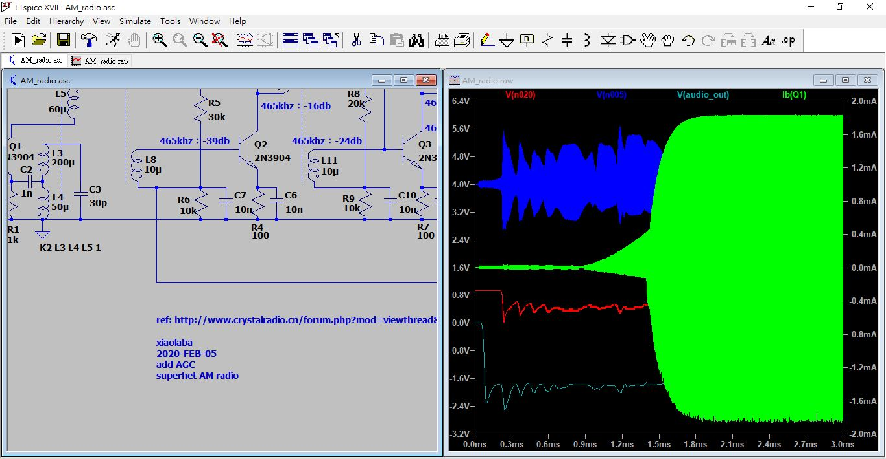
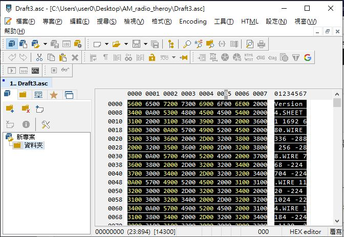
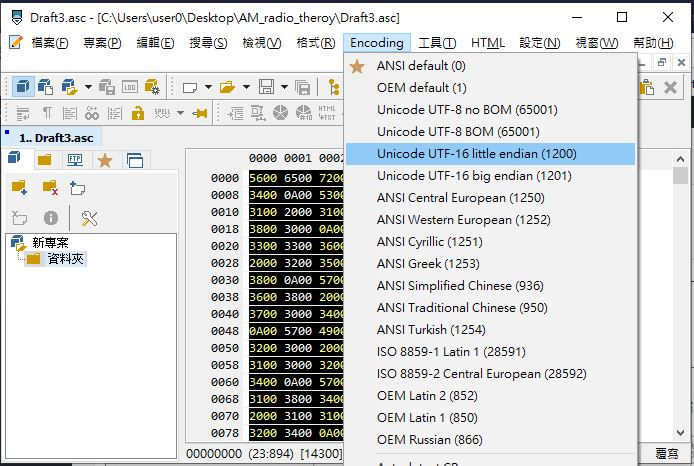
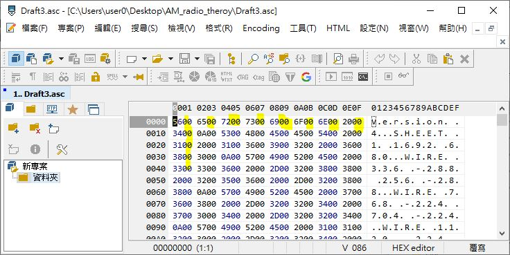
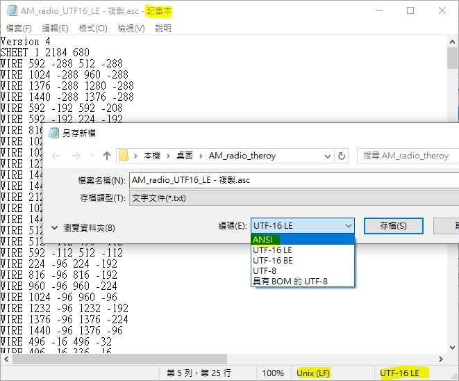

# LTSpice_XVII_UTF16_LE_format_AM_radio_AGC
To understand Software Defined Radio, and some basic of AGC, attempts to see vintage AM radio and the theory.

### simulation  

  

### source code, no more pure ASCII file !?
  

reacp :here is the solution and how to convert UTF16_LE to ANSI (pure ASCII) format  
  


  
### LTspeice vesion, circuit 
  

### no ASCII, UTF16 LE why ? how to converts to ASCII 7 bit ?

  

###  UTF16 LE, see source code

  

### normal ASCII, see source code, every 0x00 next to ASCII char



### here is the solution and how to convert UTF16_LE to ANSI (pure ASCII) format 
uses win10 utility "NOTEPAD", open and save .asc to be with "ANSI", negelects the warning of losing integrity of UTF 16 encoded.  
  

validation, done and sucess.
![ASC_ANSI_OK.JPG\(ASC_ANSI_OK.JPG)  


```

```
